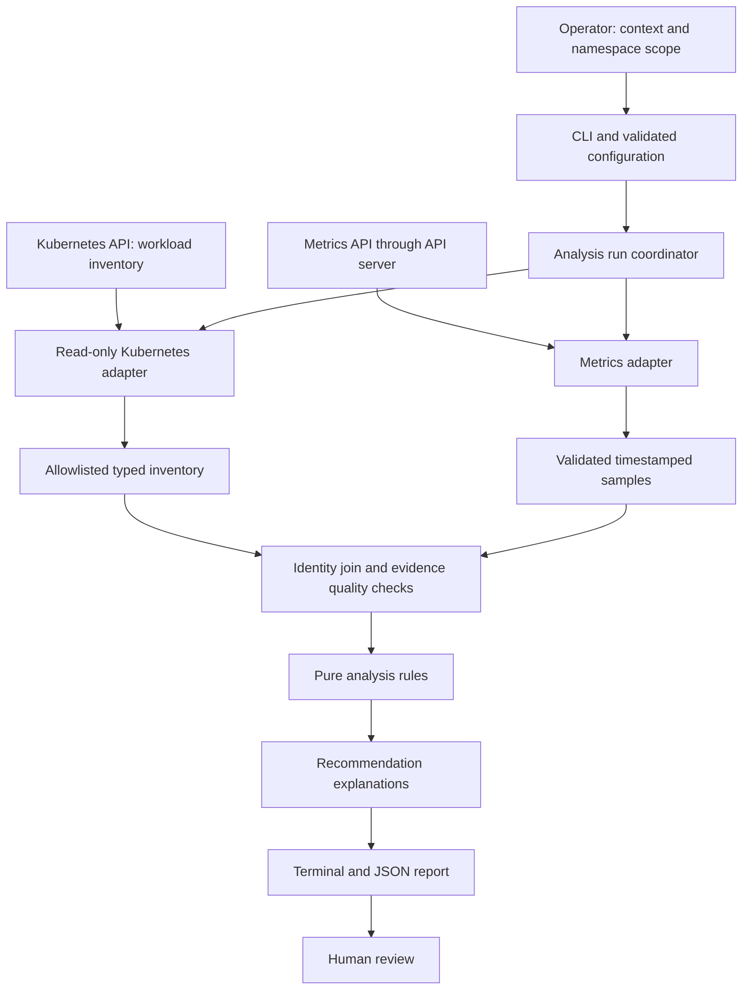

# Frozen v0.1 architecture

Status: **Architecture frozen on 2026-09-28.** D1–D3 are approved and ADRs 0001–0008 are Accepted. Milestone 1 is complete and committed. The separately authorized [Milestone 2 domain model](domain-model.md) and pure quantity conversion are complete and accepted on 2026-09-29; the collection-to-report application remains unimplemented. The approved startup clarification is recorded in Accepted [ADR 0007](adr/0007-explicit-container-started.md). Milestone 3 architecture/design is complete under Accepted [ADR 0008](adr/0008-restricted-kubeconfig-and-bounded-transport.md), dated 2026-09-30; implementation requires separate authorization.

## Requirements translated into scope

The first release should answer: “How do this workload's CPU and memory settings compare with the utilization we can observe now, and what should an engineer investigate?” It cannot yet answer: “What settings are safe across a representative production history?”

Read-only operation, least privilege, evidence traceability, and truthful limitations are release requirements. FinOps, reliability, and capacity are future analysis domains, not separate services in v0.1.

| Requirement | Accepted v0.1 behavior |
| --- | --- |
| Connect to Kubernetes | Local CLI only; official Python client with an explicit trusted kubeconfig context |
| Select namespaces | One or more explicit namespace arguments required; no discovery, implicit current namespace, or all-namespaces mode |
| Discover workloads | Deployments, Pods, regular containers; ReplicaSets for ownership traversal |
| Collect allocation | Observed Pod requests/limits plus Deployment template values, kept distinct |
| Collect utilization | Recent per-container CPU and memory from `metrics.k8s.io` |
| Detect inefficiency and risks | Conservative allocation findings and utilization-based candidates |
| Explain recommendations | Evidence, rule version, scope, uncertainty, and investigation steps |
| Historical metrics | Provider boundary now; Prometheus implementation after v0.1 |
| Human decision | Required review notice in every report; no mutation path |

## One process with explicit boundaries

Start with a synchronous, bounded CLI run. A modular monolith means the components live in one process but have separate responsibilities. This keeps development and deployment small while allowing the analysis engine to be tested without a cluster.

There is no arrow back to workloads. The engine accepts typed domain data, never a Kubernetes API client. Only adapters perform application network I/O. The initial profile excludes helpers/proxies; controlled resolved lookup and API HTTPS traffic follow the [data and egress contract](data-and-egress.md). Future authentication integrations need separate review. There is no telemetry, analytics, upload feature, or listening server. Reports go to local stdout or an explicitly selected local file; external capture or synchronization remains an operator boundary.

Use standard-library facilities where suitable, adding dependencies only for a concrete need. Milestone 1 selected the [initial reference versions/platforms/authentication](compatibility.md) using upstream evidence including the [official client's compatibility matrix](https://github.com/kubernetes-client/python). These are targets for future testing, not established OpenKube runtime support. Runtime dependencies remain empty; kubernetes==36.0.3 and h11==0.16.0 are selected only for separately authorized implementation. pyOpenSSL is not required and cryptography is not a direct dependency for this design.

The [CLI contract](cli-contract.md#complete-configuration-surface) enumerates the ten accepted user inputs. Approved D1 fixes and versions safety/evidence guards rather than exposing extra tuning knobs; approved D2 consolidates internal failures into the general failure exit. Additional configuration requires a demonstrated need not reasonably handled by this contract; additional exits require a documented reason and review. No configuration framework is needed.

## Accepted transport and setup amendment — 2026-09-30

[ADR 0008](adr/0008-restricted-kubeconfig-and-bounded-transport.md) governs the controlled synchronous adapter. The initial runtime validation target is Ubuntu 24.04 LTS x86_64 with trusted active systemd-resolved Varlink and descriptor-backed procfs loading. The selected trusted context must use the [multi-label absolute hostname profile](compatibility.md#initial-runtime-and-endpoint-profile), without search-suffix, single-label or custom NSS fallback. Address fallback is bounded; private answers are allowed; original configured hostname/port remain TLS/SNI/HTTP authority. No broad NSS equivalence or managed-platform compatibility is claimed.

Trusted local credential loading and native TLS-context construction are setup, protected by bounded inputs, parser/format guards, validation, cleanup and sanitized errors. Files must remain stable during construction; CA uses a bounded memory snapshot and client certificate/key use retained descriptors via `/proc/self/fd`. No credential copies or encrypted-key prompts; always use a rejecting callback. In-place mutation and guaranteed zeroization are outside the protection. The [security policy](security.md#trusted-credential-and-setup-boundary) gives the full boundary.

The total run clock includes setup and is never reset. Synchronous file reads/OpenSSL parsing cannot be promised hard mid-call cancellation. The unchanged per-request deadline starts with controlled Varlink resolution and covers address attempts, TCP, TLS handshake and HTTP processing. Stop after expired setup when control returns; no abandoned OpenKube-owned worker. Close owned controllable resources on timeout, without promising instantaneous daemon/shared-work cancellation. This explicitly qualifies earlier bounded-execution wording; it does not change numerical budgets or evidence methodology. Disposable probes are feasibility evidence, not implemented runtime support.

## Data flow

1. Validate the explicit local context, nonempty namespace scope, timeouts, polling limits, and output destination. Never infer a namespace, switch clusters, or fall back to in-cluster authentication. Reject insecure TLS configuration.
2. Complete v0.1 lists only the four authorized resource kinds within the supplied namespaces: M3 inventory is Pods, Deployments and ReplicaSets; M4 adds PodMetrics. Respect pagination where supported. Never list Namespace objects or call all-namespaces workload endpoints.
3. Use official generated API methods for request construction/dispatch behind OpenKube-controlled bounded wire/framing/JSON validation. Bypass stock REST error-body handling and generic generated-model deserialization as boundaries. Immediately project transient API data into the [exact allowlist](data-and-egress.md#exact-projection-allowlist), releasing raw references as soon as technically possible. Normalize CPU into exact decimal cores and memory into integer bytes, rounding valid nonnegative fractional bytes upward after exact parsing. Preserve absent values separately from zero. Reject invalid, negative, non-finite, or out-of-bound values. Raw objects must never be persisted, logged, exposed in exceptions, or included in reports.
4. Associate Pod → ReplicaSet → Deployment using controller owner references and UIDs in the same namespace. Names and label similarity are insufficient evidence of ownership. Kubernetes documents these [owner relationships](https://kubernetes.io/docs/concepts/overview/working-with-objects/owners-dependents/).
5. Default to one snapshot bracket cycle. Optional observation uses an inventory-only baseline, one global `t0`, 60-second slots for a configured 30–60 minutes (default 30), and separate final inventory. The [timeline](evidence-eligibility.md#one-observation-timeline) is authoritative: baseline/closure add no usage samples; default coverage is at least 27 of 30 distinct slots per resource. Preserve source timestamps/CPU windows and deduplicate samples.
6. Join by namespace, Pod identity, and container name. PodMetrics does not guarantee a usable Pod UID, so bracket observations with inventory checks and reject ambiguous name reuse or samples predating Pod creation. Never guess an association.
7. Apply the [evidence eligibility contract](evidence-eligibility.md), including startup, observation duration, freshness, completeness, allocation stability, and workload support. Abstain from utilization-based findings when their evidence is insufficient. Keep partial failures visible. Evaluate eligible container records independently, then group findings under Deployments without averaging away a problematic replica.
8. Project the analysis into the separate report allowlist: necessary namespace/Deployment/Pod/container names, evidence, findings, skips, sanitized errors, and run measurements. Exclude all Kubernetes UIDs, ReplicaSet names, internal identity maps, and raw objects before serialization. UIDs remain memory-only for required identity/correlation/counting and are released when no longer needed, including failure/interruption. Persist only an explicitly requested allowlisted report; never persist or log UIDs.

The API reads are not a transaction. Rollouts, restarts, and in-place resource changes can invalidate comparisons. Track opaque resource versions and allocation fingerprints; a changed resource version triggers comparison of relevant fields, not automatic invalidation. Suppress evidence affected by identity, lifecycle, or allocation changes. Deployment template values describe desired configuration, whereas observed Pod values may include admission defaults. Report differences; do not silently substitute one for the other.

Use the evidence contract's fixed 120-second startup gate, source-age bound, CPU-window ceiling, and maximum receipt gap; these are different checks with the same accepted numeric value. Require 90% whole-run per-resource coverage, no relevant instability, full duration, and successful closing inventory. Shortened runs abstain from overprovisioning. Individually eligible immediate observations remain usable. Rollout indicators may also represent scaling/readiness changes; report Deployment instability, not an unproven cause.

## Supported analysis boundary

Deployment-owned regular containers are the primary recommendation unit. Inventory may show standalone Pods and other ownership kinds, but report those as unsupported for workload recommendations. Containers within multi-container Pods are analyzed separately.

Detect and explicitly skip allocation recommendations for Pod-level resource budgets, init containers, restartable init sidecars, ephemeral containers, and inconsistent or resizing resource states until their semantics are implemented and tested. Ordinary containers in `spec.containers` remain eligible if their allocation can be interpreted independently. Never claim a complete Pod scheduling footprint: that also involves init containers and overhead.

No HPA/VPA configuration is collected in v0.1. Every report must identify autoscaling and policy interactions as unchecked. A future historical resizing design must address these interactions before proposing changes.

## Failure behavior

Under ADR 0008 D3, unprojectable mandatory identity/ownership structure invalidates that namespace inventory pass; never silently drop the object and claim completeness. Independently complete namespace inventories remain usable. Well-formed unresolved/unsupported ownership and invalid non-identity facts remain representable states subject to the existing evidence rules.

Invalid configuration returns exit 2 before analysis. Authentication/TLS/internal failure or no usable complete namespace inventory returns failed/3. Namespace authorization or API failures with usable inventory elsewhere, missing required metrics, or insufficient applicable evidence yield incomplete/4. Required sources must succeed; tolerated rejected/duplicate sample slots need not fail an otherwise evaluable run. A successfully read empty namespace is valid inventory; inapplicable/known unsupported rules do not alone make a run incomplete. Complete/0 never means healthy or optimized. The CLI contract is authoritative for delivery errors (5), interruption (130), and precedence.

Use bounded requests, retries with backoff for transient failures, and a total run deadline with the dated setup qualification above. Do not retry authorization failures or broaden scope after a denial. The [CLI acceptance contract](cli-contract.md) defines limits/deadlines and delivery behavior. Never intentionally truncate a report to fit; fully serialize before delivery. A broken stdout pipe can leave a partial external byte stream, which is an output failure, never successful JSON delivery. The [data contract](data-and-egress.md#data-openkube-may-write-to-reports) defines the entire conceptual report, including coverage without findings, exact counters, and closed errors/limitations.

## Deliberate exclusions

- Workload writes, automated remediation, autoscaling, operators, admission webhooks, and CRDs.
- Namespace discovery, cluster-wide collection, in-cluster authentication/execution, and collector Jobs/images. In-cluster execution needs a separate future ADR.
- Historical storage, Prometheus queries, production P95 claims, numerical resize targets, and HIGH confidence optimization advice.
- FastAPI, dashboards, Grafana integration, authentication servers, multi-tenancy, and multi-cluster aggregation.
- Nodes, scheduler simulation, bin packing, cluster capacity forecasts, cloud pricing, billing integrations, and monetary savings estimates.
- Logs, traces, application traffic, network/storage/GPU optimization, and broad security/compliance scanning.
- Helm, Argo CD, Terraform, Ansible, queues, databases, and OpenTelemetry until a demonstrated requirement justifies them.
- Pseudonymized/privacy-enhanced reporting; consider only through a future ADR for a real use case.

## Architecture freeze and implementation gate

The user permits transient API-object exposure only where technically required by the official client, with immediate projection and no raw-object artifacts. This resolves the previous interpretation blocker; it does not make projection a security isolation boundary or promise memory zeroization. Names may still be sensitive.

D1–D3 are resolved in the [consistency review](consistency-review.md#resolved-decisions-and-acceptance). D3 permits necessary human-readable names, which may contain sensitive organizational information; reports must be treated as potentially sensitive. UIDs are internal memory-only, with no report/log/persistence path. No pseudonymization is implemented or planned for v0.1. Final architecture review found no remaining architecture blocker. Implementation risks and acceptance tests remain in the [roadmap](roadmap.md#remaining-implementation-validation-items).

The scope, data allowlists, ten-input configuration, closed 18-group report contract, and six exits remain frozen. ADR 0008 amends the transport/setup trust and cancellation boundary. Its architectural bounds, existing operational limits and additional implementation guards are distinct; the latter add no report keys or user inputs. Evidence-v1 has a dated, explicitly approved startup clarification; other gates remain unchanged. New requirements must be justified and reviewed; major changes use an ADR that supersedes the accepted decision. Milestone 2 authorization covers only the documented domain records and pure conversion. No runtime dependencies, cluster changes, or Milestone 3 implementation are authorized.
